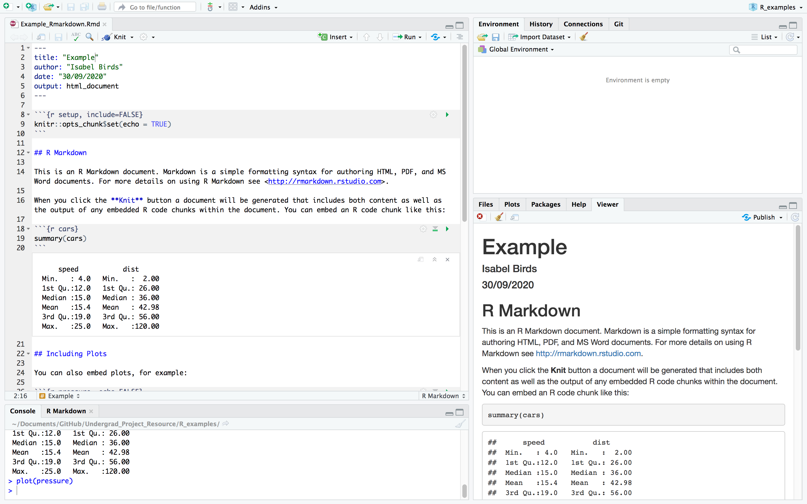

# Useful R Resources

R is a really popular language, particularly for working with data in biology, so there are loads of packages and tutorials out there.

It's also generally more popular with women and other marginalised genders due to the strong, diverse community. Python is lagging behind a bit here... [twitter thread](https://twitter.com/krose621/status/1309162076611411968?s=20) if you want an intro the the rabbit hole of drama.

See also [R-ladies](https://rladies.org/) - the name needs work, but it's a super friendly community for anyone who isn't a cis man, whether you're looking for troubleshooting, a job or just some fun coding. :smile:

R can be run in RStudio, an integrated development environment. So basically, instead of typing straight into the terminal like this:

You get a nice friendly set up like this:

## [Introduction to R](https://bioinformatics-core-shared-training.github.io/r-intro/index.html)

Ongoing (as of 2020) WFH course run by the Bioinformatics Core at CRUK Cambridge Institute. Looks like a good, relevant introduction to R, RStudio, data manipulation and plots. You can’t access their video chat but all materials and solutions are available.

## [Data Carpentry](https://datacarpentry.org/lessons/)

A fantastic project aimed at teaching researchers fundamental data skills. Lots of resources! [Here](https://datacarpentry.org/R-ecology-lesson/01-intro-to-r.html) would be a good place to start.

## [Stackoverflow](https://stackoverflow.com/)

If you can’t work out how to do something, lots of other people have definitely also had the same issue, so don’t spend ages trying to work it out from scratch. Google and stackoverflow – LOTS of programming community questions and answers - are your friends.

## [Biostars](https://www.biostars.org/)

As you move more into the biological aspects of your analysis, Biostars is the equivalent of Stackoverflow for your questions. How to get raw data, what a certain option in a program means – lots of community info here! Also feel free to ask your own questions, but do your own research first - people help each other for free, so don't take the mic!
